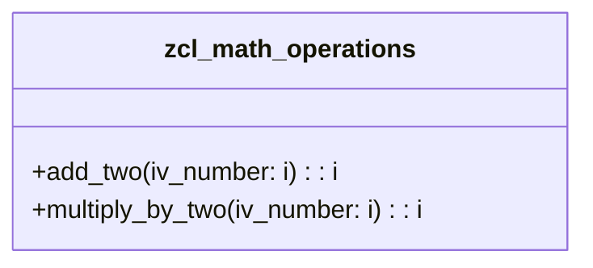

# ABAP-Unit-Tests
ABAP Unit Tests e diferentes exemplos

"Se vi mais longe, foi por estar sobre os ombros de gigantes"

## Sobre

## Good to know

### 01 Math
Este é um exemplo básico para servir como o primeiro passo no aprendizado de ABAP.  
O [código está disponível aqui](./code/Math.abap) para consulta e atualizações.

Para isso foram seguidos os segintes passos.
- Criar uma classe ABAP com os seguintes metodos
    - add_two
    - multiply_by_two

## Recursos

- **ABAP**: Conteúdo relacionado ao desenvolvimento em ABAP.
- **ABAP Cloud**: Conteúdo relacionado ao desenvolvimento em ABAP Cloud.

## Como Contribuir

## Licença

Este projeto está licenciado sob a licença SAP. É um produto da empresa [SAP](https://www.sap.com/index.html).  